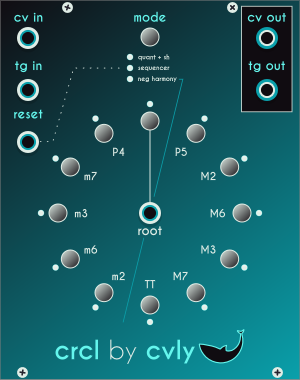

# crcl
_Pronounced "Circle"_
***

Multimode module based on the [circle of fifths](https://en.wikipedia.org/wiki/Circle_of_fifths)

### Mode 1: Quantizer + Sample & Hold

In this mode, crcl quantizes the voltage coming through the CV input.

If the trigger input is connected, it will also act as a Sample & Hold, only quantizing the voltage when a trigger is received, and holding that value until the next trigger.

The reset input is not used in this mode.

### Mode 2: Sequencer

In this mode, crcl functions as a sequencer, receiving the clock in the trigger input, and ciclying through the circle of fifths. The output CV is kept inside one octave from the root.

The CV input can be used to reverse the direction of the sequence:
* When at 0v or higher, the sequence moves forward.
* When lower than 0v the sequence is reversed.

### Mode 3: Negative Harmony

This mode works exactly like mode 1, except that after quantizing the input signal, it will instead output the mirror note using the line between the tonic and the fifth as axis.

This is based on the music theory concept of [Negative harmony](https://hellomusictheory.com/learn/negative-harmony/).

Mirror notes:
* Tonic <> Perfect 5th
* Perfect 4th <> Major 2nd
* Minor 7th <> Major 6th
* Minor 3rd <> Major 3rd
* Minor 6th <> Major 7th
* Minor 2nd <> Tritone
