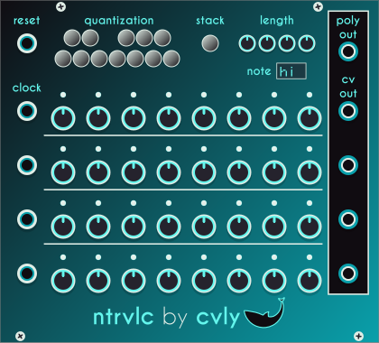
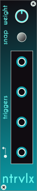

# ntrvlc
_Pronounced "Intervallic"_
***

Four 8-step sequences with an incorporated equi-likely quantizer. Each of the four sequences has an independent clock input and a separate output, along with a common polyphonic output. Only sequences with a connected clock input will be sent to the poly out.

If the quantizer does not have any notes active, the module will output raw voltage.

Voltage range can be set in the context menu.

### Stack button
If the stack button is on, the first active sequencer will work normally, but each subsequent sequence will be built on top of the last one, adding or subtracting from the previous voltage. If it's off, each sequencer will function independently.

## ntrvlx expander

The expander adds two controls over the stacking function: weight and snap.

**Weight** attenuates the base CV before adding, so at 1 it works the same as without the expander, and at 0 is the same as stacking off.

**Snap** makes it so that each output is within the selected voltage range when stacking, taking weight into account:

OUTn = ((CVn-1 * weight) + CVn) / (1 + weight)

It also adds 4 triggers, one for each sequence, that fire whenever the output of its sequence changes. Option to turn first output to poly in the context menu.
