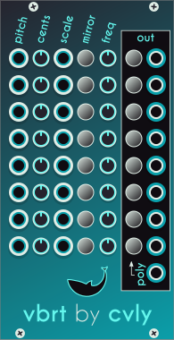

# vbrt
_Pronounced "Vibrate"_
***

Multiple pitch voltage detuner with incorporated per-channel LFO.

Each row has:
* Input for pitch (1v/oct), normalized to the previous input.
* Range of detuning in cents (both up and down), which will vary with the LFO.
* Scaling input (0-10v) for the detuning amount.
* Mirror mode will change the output into a polyphonic output with two channels, with mirrored detuning.
* Frequency for the sine LFO (if set to 0, the channel will work like a simple detuner).
* Switch to send the channel to the polyphonic output.